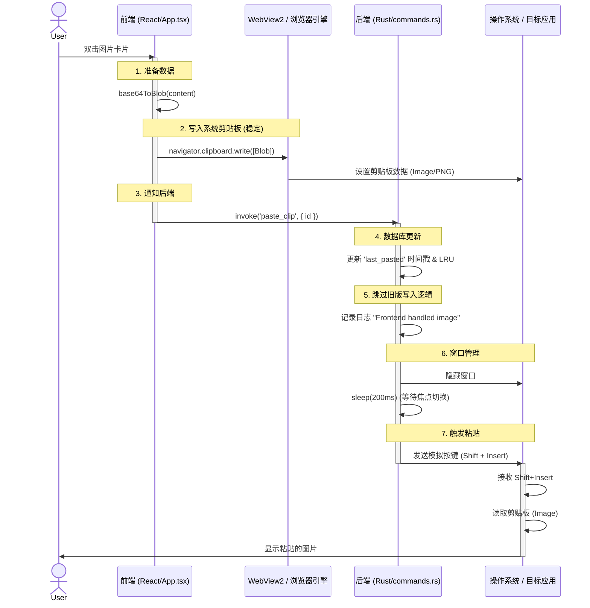

<h1 align="center">
    <picture>
      
    </picture>
    PastePaw - Clipboard History Manager
</h1>


<p align="center">
  <a href="README_CN.md">中文</a> •
  <a href="README.md">English</a>
</p>

<p align="center">
  <a href="https://github.com/XueshiQiao/PastePaw/actions/workflows/release.yml?branch=main"></a>
  <a href="https://github.com/XueshiQiao/PastePaw/releases"></a>
  <a href="LICENSE"></a>
</p>

一款为 Windows 打造的精美剪贴板历史管理工具，基于 Rust + Tauri + React + TypeScript 构建。

## 功能特性

- 🔒 **隐私安全** - 这一点至关重要！所有数据仅存储在本地，绝不上传。
- 🎨 **精美界面** - 现代化的深色/浅色主题，支持即时切换，配合流畅的动画效果。
- ⚡ **轻量极速** - 基于 Rust 构建，性能强劲，资源占用极低。
- ⌨️ **自定义快捷键** - 设置您习惯的快捷键来随时呼出历史记录。
- 📋 **历史记录** - 自动保存您复制的所有内容。
- 🖥️ **多显示器支持** - 智能跟随，始终在鼠标所在的活动显示器上显示。
- 🔍 **快速搜索** - 即使历史记录再多，也能秒级找到复制过的内容。
- 📁 **文件夹管理** - 将常用的剪贴内容分类整理到自定义文件夹。
- 🚫 **应用屏蔽 (排除列表)** - 自动忽略来自特定敏感应用（如密码管理器）的内容，保护隐私。
- 🔄 **无限滚动** - 无缝浏览无限的历史记录，无需翻页。
- 🛡️ **智能过滤** - 采用智能防抖逻辑，自动忽略来自其他剪贴板工具（如翻译软件、输入法）的“幽灵复制”。
- 🤖 **AI 智能助手** - 内置 AI 功能，支持一键总结、翻译、解释代码以及修复语法错误。
- ⚙️ **高度可自定义 AI** - 支持在设置中完全自定义 AI 功能的名称以及系统提示词 (Prompt)，打造专属您的 AI 工作流。

## 应用截图

### Light theme

### Dark theme


## 键盘快捷键

### 全局
- **显示/隐藏窗口**: `Ctrl+Shift+V` (默认，可在设置中自定义)

### 应用内

- `Ctrl + F` - 聚焦搜索框
- `Escape` - 关闭窗口 / 清除搜索
- `Enter` - 粘贴选中的项目
- `Delete` - 删除选中的项目
- `P` - 钉住/取消钉住选中的项目
- `Arrow Up/Down` - 上下导航列表
## 应用屏蔽 (排除列表)

PastePaw 允许您将特定应用程序排除在记录范围之外。这对于保护密码管理器或银行应用等涉及敏感信息的场景非常有用。

**逻辑与行为机制：**

- **如何管理：** 进入“设置” -> “应用屏蔽”。您可以浏览选择 `.exe` 文件，或直接输入进程名称。
- **隐私保护：** 当发生复制操作时，PastePaw 会第一时间检查源应用程序是否在您的忽略列表中。
- **双重匹配机制：** 系统会同时检查以下两项，满足任一条件即忽略：
    1.  **进程名称** (例如 `notepad.exe`) - 匹配任何位置运行的该名称程序。
    2.  **完整路径** (例如 `C:\Windows\System32\notepad.exe`) - 仅匹配特定安装路径下的该程序。
- **不区分大小写：** 匹配过程不区分大小写，确保在 Windows 环境下检测的可靠性。

## AI 智能助手

PastePaw 集成了方便的 AI 能力，帮助您更高效地处理剪贴板内容。
(需要您自行提供 AI 提供商的 API Key)

- **功能操作：** 右键点击任何剪贴项即可呼出 AI 功能：
    - **内容总结：** 快速提取长文本的核心内容。
    - **翻译：** 将内容翻译为您的目标语言。
    - **解释代码：** 瞬间理解复杂的代码片段。
    - **语法修复：** 润色您的写作，进行专业的语法检查。
- **完全自定义：**
    - **自定义名称：** 您可以在设置中重命名 AI 功能（例如，将“翻译”改为“翻译成日语”）。
    - **自定义提示词：** 修改默认的系统提示词 (System Prompt)，精确控制 AI 的行为和输出风格。
    - **多模型支持：** 支持 OpenAI、DeepSeek 以及其他兼容 OpenAI 接口的自定义 API 服务。

## 技术栈

- **后端**: Rust + Tauri 2.x
- **前端**: React 18 + TypeScript
- **数据库**: SQLite
- **样式**: Tailwind CSS
- **包管理器**: pnpm

## 快速开始

### 环境要求

- Node.js 18+
- Rust 1.70+
- pnpm

### 安装步骤

```bash
# 安装依赖
pnpm install

# 安装 Tauri CLI
cargo install tauri-cli

# 运行开发环境
pnpm tauri dev
```

### 构建打包

```bash
# 构建生产版本
pnpm tauri build
```

## 项目结构

```
PastePaw/
├── src-tauri/           # Rust 后端代码
│   ├── src/
│   │   ├── main.rs      # 应用入口
│   │   ├── lib.rs       # 核心逻辑
│   │   ├── clipboard.rs # 剪贴板监听与管理
│   │   ├── database.rs  # SQLite 数据库操作
│   │   ├── commands.rs  # Tauri IPC 通信指令
│   │   └── models.rs    # 数据模型
│   └── Cargo.toml
├── frontend/            # React 前端代码
│   ├── src/
│   │   ├── components/  # UI 组件
│   │   ├── hooks/       # React Hooks
│   │   ├── types/       # TypeScript 类型定义
│   │   └── App.tsx
│   └── package.json
└── README.md
```

## 开发说明

### Tauri 命令参数映射

Tauri v2 在 JavaScript/TypeScript 和 Rust 之间强制执行严格的大小写映射规则：

- **JavaScript/前端:** 在 `invoke` 调用中使用 **小驼峰命名法 (camelCase)** (例如 `filterId`)。
- **Rust/后端:** 在 `#[tauri::command]` 函数参数中使用 **蛇形命名法 (snake_case)** (例如 `filter_id`)。

**示例：**

*   **前端:** `invoke('get_clips', { filterId: 'pinned' })`
*   **后端:** `pub fn get_clips(filter_id: Option<String>)`

如果不遵循此约定（例如从前端传递 `snake_case` 参数），会导致后端接收到的参数为 `null` 或 `None`。

### 窗口行为与多显示器支持

应用程序设计为在按下全局快捷键时，始终出现在 **活动显示器**（鼠标光标所在的显示器）上。

- **检测逻辑:**
    - 位于 `src-tauri/src/lib.rs` 中的 `animate_window_show` 函数。
    - 使用 Windows API `GetCursorPos`（通过 `windows` crate）获取全局鼠标坐标。
    - 遍历 `window.available_monitors()`，查找包含当前光标坐标的显示器。
    - 兜底策略：如果无法确定光标位置，默认显示在 `window.current_monitor()`。

- **定位逻辑:**
    - 窗口定位于检测到的活动显示器的工作区底部（排除任务栏区域）。
    - 呼出时会有从底部向上滑出的动画效果。

### 调整布局

本项目使用中心化的布局系统，确保原生窗口大小与前端虚拟列表保持同步。

-   **后端常量:** `src-tauri/src/constants.rs` (控制操作系统窗口的物理尺寸)。
*   **前端常量:** `frontend/src/constants.ts` (控制 UI 渲染和计算)。

#### 如何修改卡片高度
卡片高度是动态的，会填满可用的窗口空间。如需修改：
1.  同时更新 `constants.rs` 和 `constants.ts` 中的 `WINDOW_HEIGHT` 值，确保两者一致。
2.  重启应用程序（修改 Rust 代码后必须重启）。

#### 如何修改垂直间距 (安全区)
如果需要调整卡片顶部/底部的留白（例如防止鼠标悬停时被遮挡）：
1.  修改 `frontend/src/constants.ts` 中的 `CARD_VERTICAL_PADDING`。
2.  **增加**此值会使卡片变**矮**；**减小**此值会使卡片变**高**。

## 架构与设计决策

### 复制图片时，为什么使用前端剪贴板？（解决 "Thread does not have a clipboard open" 问题）

我们采用 **混合剪贴板方案** 来解决臭名昭著的 Windows `OSError 1418` (Thread does not have a clipboard open) 错误。

-   **后端 (Rust)**: 擅长监控剪贴板变化和执行数据库检查。但在 Windows 上，剪贴板访问被严格绑定到创建窗口的线程 (STA)。尝试从后台 Tokio 线程直接写入图像数据经常会导致竞争条件和 "OpenClipboard Failed" 错误。
    解决方案就是放在主线程去做 write image, 但是放在主线程会严重拖慢 UI 响应速度，导致卡顿。
-   **前端 (WebView2)**: 浏览器引擎（WebView2）拥有成熟、稳定且经过广泛测试的 `navigator.clipboard.write` 实现。

**我们的解决方案：**
1.  **前端**: 负责将 **图像 Blob** 直接写入系统剪贴板（稳定可靠）。
2.  **后端**: 负责更新内部数据库（记录历史、更新时间戳）并触发粘贴快捷键 (`Shift+Insert`)。

### 为什么使用 `Shift+Insert` 进行粘贴？

我们使用 `Shift + Insert` 作为默认的自动粘贴触发器，而不是 `Ctrl + V`。

-   **终端兼容性**: `Ctrl+V` 在许多终端模拟器（如 PowerShell, WSL, VS Code Integrated Terminal）中经常失效，它发送的是控制字符而不是执行粘贴命令。
-   **传统标准**: `Shift+Insert` 是几乎所有 Windows 应用程序（包括所有终端和旧版软件）都认可的通用粘贴标准。

### 粘贴图片的时序图 (Sequence Diagram)



### Buy me a coffee

如果对你有帮助，给我家小公主买杯喝的吧，谢谢<br/>
欢迎在备注中加上你 GitHub 名字<br/>
<a href="https://raw.githubusercontent.com/XueshiQiao/PastePaw/refs/heads/main/docs/sponsor_code_wechat.jpg" ></a>
